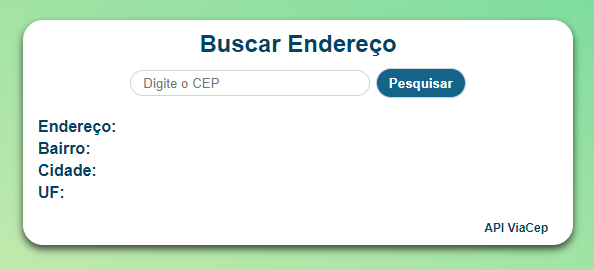
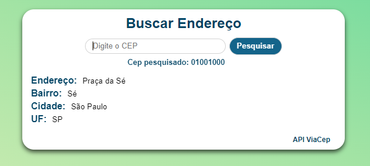
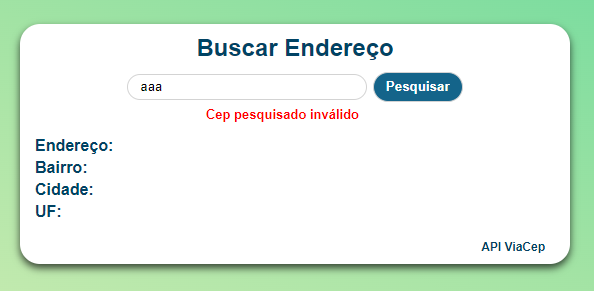

# :mailbox_with_mail: Consultar CEP :mailbox_closed:

Aqui tem um mini projeto em HTML, CSS e JavaScript para consulta de códigos de endereçamento postal (CEP) através do site da API [ViaCEP](https://viacep.com.br/).

Esse projeto está hospedado no GitHub Pages, podendo ser acessado por [aqui](https://cellerligia-23.github.io/buscar_cep/).

  
   
  

- **Usando** :computer:
  - Variáveis e Constantes; :white_check_mark:  
  - Tipos de Operadores: Aritméticos; :white_check_mark:  
  - Boolean (True or False); :white_check_mark:  
  - Operadores Condicionais; :white_check_mark:  
  - Estrutura Condicional; :white_check_mark:  
  - Funções; :white_check_mark:
  - Objetos; :white_check_mark:
  - Arrys e Estrutura de Repetição; :white_check_mark:
  - Fetch/then; :white_check_mark:
  - Conceito básico de Media Queries (CSS); :white_check_mark:
  

### Imagens da página:

  
  

  

